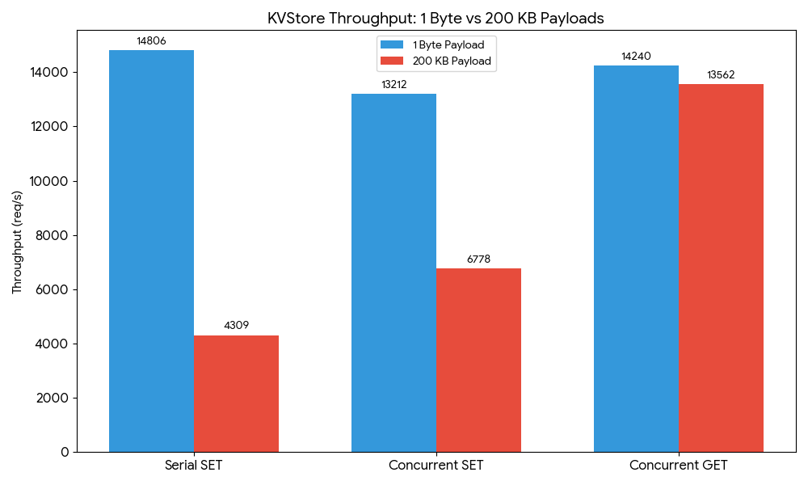
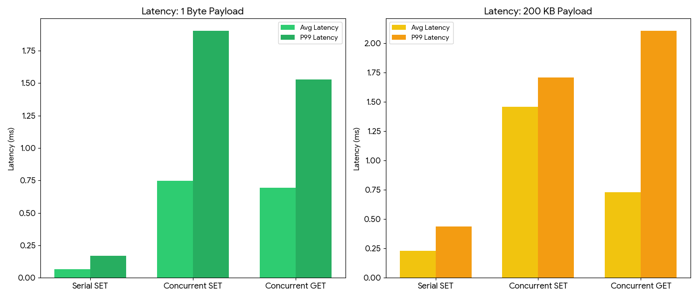

# C++ Multi-Threaded Key-Value Store

A high-performance, asynchronous Key-Value store built on a custom **Reactor Pattern** architecture. This project demonstrates modern C++ systems programming, focusing on non-blocking I/O, thread safety, and performance observability.


## Core Competencies
This project serves as a comprehensive implementation of modern systems programming patterns:

* **Reactor Pattern:** High-performance Linux I/O multiplexing using `poll()`.
* **Multi-threaded Model:** Thread Pool architecture with asynchronous worker callbacks.
* **Concurrency:** Thread-safe data structures utilizing `std::shared_mutex` for reader-writer optimization.
* **Memory Management:** Modern C++ paradigms including RAII, Move semantics, and Smart Pointers.
* **Performance Analysis:** Data-driven optimization focused on throughput and **P99 tail latency**.
* **Full-Stack Testing:** Automated validation via **GTest** (Unit) and **Pytest** (Integration).


## Performance Benchmarks

Benchmarks were conducted using `scripts/benchmark.py` to evaluate the server under two conditions: **Low Payload** (1B) to measure overhead, and **High Payload** (200KB) to measure I/O and locking efficiency.

### Throughput Analysis

Throughput measures the total requests processed per second. The results show a clear "efficiency ceiling" at approximately **14k req/s**.




| Payload | Test | Clients | Throughput (req/s) | Avg Latency (ms) | P99 Latency (ms) |
| ---        | ---            | ---| ---       | ---   | ---   |
| **1 Byte** | Serial SET     | 1  | 14,806    | 0.06  | 0.17  |
| **1 Byte** | Concurrent SET | 10 | 13,211.63 | 0.747 | 1.902 |
| **1 Byte** | Concurrent GET | 10 | 14,239    | 0.69  | 1.52  |
| **200 KB** | Serial SET     | 1  | 4,309.16  | 0.231 | 0.439 |
| **200 KB** | Concurrent SET | 10 | 6,778     | 1.46  | 1.70  |
| **200 KB** | Concurrent GET | 10 | 13,561    | 0.73  | 2.10  |

### Latency & Tail Stability

Latency measures individual response times. The "P99" represents the 99th percentile, highlighting the worst-case "jitter" users might experience.



### Key Findings

* **Effective Reader-Writer Locking:** In the 200KB test, **Concurrent GET** throughput is **2x higher** than SET. This proves the `std::shared_mutex` implementation successfully allows parallel reads during heavy I/O.
* **The Reactor Ceiling:** Both workloads peak near **14k req/s**. This indicates the bottleneck is the single-threaded Reactor's management of syscalls and data copying, rather than the `Store` logic itself.
* **Predictable Scaling:** Despite a **200,000x** increase in payload size, P99 latency remained remarkably stable (increasing only ~38%), demonstrating that the architecture handles bulk data without stalling.

### Potential Optimizations

1. **Zero-Copy I/O:** Use `writev()` to send data directly from the Store to the socket.
2. **Task Inlining:** Execute small requests directly in the Reactor to avoid Thread Pool context-switching "tax."
3. **Syscall Batching:** Aggregate I/O operations per event loop cycle.


## Testing & Validation

Quality is ensured through a multi-tiered automated testing suite:

* **Unit Tests (GTest):** Validates core logic for the Store, Thread Pool, and Command Parsers in isolation.
* **Integration Tests (Python):** End-to-end validation of the network stack, protocol compliance, and concurrency handling.
* **Performance Tracking:** Automated benchmarking script with JSON-based baseline comparison to prevent architectural regressions.


## Quick Start

### Build Requirements

* **OS:** Linux (Utilizes Linux-specific `poll.h` and POSIX sockets)
* **Compiler:** GCC 10+ / Clang 10+ (**C++20 Standard**)
* **Build System:** CMake 3.10+
* **Environment:** Python 3.8+ (for integration tests and benchmarking)


### Compilation

```bash
mkdir build && cd build
cmake .. -DCMAKE_BUILD_TYPE=Release
cmake --build .

# Installs pytest for integration tests
pip install -r tests/integration/requirements.txt
```

### Running Tests

```bash
# Run Unit & Integration Tests
ctest --output-on-failure

# Unit tests only
ctest -E "Integration" --output-on-failure
# Integration tests only
ctest -R "Integration" --output-on-failure

# Run Benchmarks
# Start the server
./build/src/server/kv_server
# In a new terminal run
python3 scripts/benchmark.py

```
